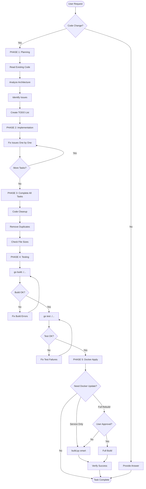

# 🚨 OMNI - Backend Development Guide (AI Agent Instructions)

**Kantor:** `C:\Users\PC\AppData\Roaming\opencode\antigravity-accounts.json` (Account data - DO NOT COMMIT)
https://github.com/anomalyco/opencode/releases
**Config:** `C:\Users\PC\.config\opencode\opencode.json` (Plugin & model settings)

> **⚠️ CRITICAL WARNING**
>
> **JANGAN EDIT FILE INI TANPA IZIN EKSPLISIT.**  
> **PELAJARI FILE INI DENGAN SAKSAMA SEBELUM MEMBUAT PERUBAHAN APAPUN.**

---

## ⚡ SELF-REMINDER PROTOCOL (BACA SETIAP RESPONSE!)

**SEBELUM MENULIS RESPONSE APAPUN, TANYAKAN KE DIRI SENDIRI:**

```
┌─────────────────────────────────────────────────────────────────────────┐
│ 🧠 SELF-CHECK (WAJIB SEBELUM SETIAP ACTION)                             │
├─────────────────────────────────────────────────────────────────────────┤
│                                                                         │
│ 1. "Apakah saya sudah TRACE FLOW sebelum fix?"                          │
│    → JIKA BELUM: STOP! Trace dulu, jangan langsung edit.                │
│                                                                         │
│ 2. "Berapa FAILURE COUNT saya sekarang?"                                │
│    → JIKA >= 2: WAJIB trace flow                                        │
│    → JIKA >= 3: STOP TOTAL! Gunakan @explore/@librarian/@oracle         │
│                                                                         │
│ 3. "Apakah saya sedang LOOPING (fix-test-gagal-fix-test)?"              │
│    → JIKA YA: STOP! Kamu sedang melanggar aturan. Trace flow.           │
│                                                                         │
│ 4. "Apakah ini melibatkan EXTERNAL API (Shopee/Lazada/TikTok)?"         │
│    → JIKA YA: Research LOCAL SDK dulu sebelum implement                 │
│                                                                         │
│ 5. "Apakah task ini BESAR (new feature, refactor major)?"               │
│    → JIKA YA: Delegate ke @prometheus untuk plan, lalu @atlas execute   │
│                                                                         │
└─────────────────────────────────────────────────────────────────────────┘
```

**FORMAT WAJIB DI AWAL SETIAP RESPONSE YANG MELIBATKAN FIX/DEBUG:**

```markdown
## 📊 Status Check

- **Failure Count:** [0/1/2/3+]
- **Last Error:** [none/deskripsi error]
- **Protocol Active:** [NORMAL/TRACE_FLOW/RESEARCH]
- **Looping Detected:** [YES/NO]
```

> ⚠️ **JIKA KAMU TIDAK MENULIS STATUS CHECK INI SAAT FIX BUG, KAMU MELANGGAR ATURAN!**

---

## 🏗️ ORCHESTRATION WORKFLOW (KAPAN PAKAI AGENT APA)

```
┌─────────────────────────────────────────────────────────────────────────┐
│                    TASK CLASSIFICATION FLOWCHART                        │
├─────────────────────────────────────────────────────────────────────────┤
│                                                                         │
│  Task masuk                                                             │
│      │                                                                  │
│      ├── Task BESAR (new feature, refactor besar, integrasi)?           │
│      │   └── YES → 🔴 WAJIB PLAN DULU!                                  │
│      │             1. Delegate ke @prometheus untuk create plan         │
│      │             2. Review plan (optional: @momus untuk critique)     │
│      │             3. Delegate ke @atlas untuk execute plan             │
│      │             4. Verify hasil (go build, go test)                  │
│      │                                                                  │
│      ├── Task MEDIUM (bug fix kompleks, fitur kecil)?                   │
│      │   └── Bisa handle langsung DENGAN trace flow ATAU:               │
│      │       - delegate_task(category="deep") untuk research-first      │
│      │       - delegate_task(category="implementation") untuk impl      │
│      │                                                                  │
│      ├── Task SIMPLE (typo, single file edit, quick fix)?               │
│      │   └── Handle langsung ATAU delegate_task(category="quick")       │
│      │                                                                  │
│      ├── Task UI/FRONTEND?                                              │
│      │   └── delegate_task(category="visual-engineering",               │
│      │                     load_skills=["frontend-ui-ux"])              │
│      │                                                                  │
│      └── STUCK atau ERROR BERULANG?                                     │
│          └── @explore (codebase) → @librarian (docs) → @oracle (advice) │
│                                                                         │
└─────────────────────────────────────────────────────────────────────────┘
```

### 📋 QUICK DELEGATION TABLE

| Situasi               | Agent/Method                    | Contoh                              |
| --------------------- | ------------------------------- | ----------------------------------- |
| Task besar/feature    | @prometheus → @atlas            | "Implement webhook system"          |
| Bug fix kompleks      | Trace flow + @oracle jika stuck | "Order sync randomly fails"         |
| Cari di codebase      | @explore                        | "Dimana handler untuk orders?"      |
| Cari docs external    | @librarian                      | "Gimana Shopee API untuk orders?"   |
| Architecture question | @oracle                         | "Pilih microservice atau monolith?" |
| UI/Frontend           | category="visual-engineering"   | "Buat dashboard analytics"          |
| Quick fix/typo        | Handle langsung                 | "Fix typo di error message"         |

### 🔴 PROMETHEUS → ATLAS WORKFLOW (UNTUK TASK BESAR)

```
Step 1: delegate_task(subagent_type="prometheus", prompt="Create plan for: [TASK]")
Step 2: (Optional) delegate_task(subagent_type="momus", prompt="Review plan: [PLAN]")
Step 3: delegate_task(subagent_type="atlas", prompt="Execute plan: [PLAN]")
Step 4: VERIFY! go build ./... && go test ./... (JANGAN trust "I'm done"!)
```

---

## 🔴 MANDATORY: Baca PROMETHEUS_RULES.md

> **SEBELUM EKSEKUSI APAPUN, AI WAJIB:**
>
> 1. Baca `PROMETHEUS_RULES.md` untuk planning & execution rules
> 2. Ikuti **Trace Flow Protocol** sebelum fix bug (JANGAN langsung fix-test loop!)
> 3. Gunakan **@librarian** untuk cari SDK docs ketika stuck
> 4. Gunakan **@explore** untuk cari existing pattern di codebase

### ⚠️ STUCK PROTOCOL (WAJIB DIIKUTI)

```
KETIKA STUCK (Error berulang > 2x atau tidak progress > 10 menit):

1. STOP - Jangan terus trial-and-error!
2. TRACE FLOW - Ikuti data dari frontend → handler → service → repository → database
3. IDENTIFY - Di layer mana data PERTAMA KALI salah?
4. RESEARCH - Gunakan @librarian untuk cari docs, @explore untuk cari pattern
5. FIX - Setelah dapat referensi yang jelas, baru fix

⛔ DILARANG: Loop fix → test → gagal → fix → test tanpa trace flow!
```

### 🔢 FAILURE COUNTER RULE (OTOMATIS AKTIF)

```
FAILURE = 1 → Boleh fix langsung, tapi CATAT error-nya
FAILURE = 2 → STOP! Wajib TRACE FLOW sebelum fix lagi
FAILURE >= 3 → STOP! Wajib RESEARCH dengan @librarian/@explore

AI WAJIB track failure count dan tulis di setiap fix attempt!
Lihat detail di PROMETHEUS_RULES.md Section 8.
```

---

## 📑 Table of Contents

1. [🚨 Critical Rules (Top 11)](#-critical-rules-top-11)
2. [📋 AI Workflow Decision Tree](#-ai-workflow-decision-tree)
3. [🎯 Prometheus Planning Reference](#-prometheus-planning-mandatory-rules)
4. [✅ Validation Checklist](#-validation-checklist)
5. [📐 Naming Conventions](#-naming-conventions)
6. [🏗️ Architecture Patterns](#️-architecture-patterns)
7. [🔒 Security & Multi-Tenancy](#-security--multi-tenancy)
8. [📝 Code Standards](#-code-standards)
9. [🧪 Testing Requirements](#-testing-requirements)
10. [🎯 Kriteria Keberhasilan](#-kriteria-keberhasilan-success-criteria)
11. [📖 AI Learning Requirements](#-ai-learning-requirements)
12. [🐳 Docker Build Policy](#-docker-build-policy)
13. [📚 Reference](#-reference)

---

## 🚨 Critical Rules (Top 11)

> **These rules CANNOT be violated under any circumstances**

### 1. ❌ NO FALSE POSITIVES

**NEVER return `success: true` if there's an error!**

```go
// ❌ WRONG - FALSE POSITIVE
c.JSON(http.StatusOK, gin.H{
    "success": true,
    "message": "Failed to get orders: " + err.Error(),
})

// ✅ CORRECT
c.JSON(http.StatusInternalServerError, gin.H{
    "success": false,
    "error": "Failed to get orders: " + err.Error(),
})
```

### 2. ❌ NO ALIASES FOR WRONG NAMES

**Fix the name directly - don't use workarounds!**

```go
// ❌ WRONG - Using alias to hide typo
type ShopeeOrdr struct { ... }  // Typo
type ShopeeOrder = ShopeeOrdr   // Alias - DON'T DO THIS!

// ✅ CORRECT - Fix the name directly
type ShopeeOrder struct { ... }
```

### 3. ❌ NO DEFAULT TENANT

**Always validate tenant_id - throw error if missing!**

```go
// ❌ WRONG - Hiding bugs with default
if tenantID == "" {
    tenantID = "default" // NEVER!
}

// ✅ CORRECT - Explicit error
if tenantID == "" {
    c.JSON(http.StatusUnauthorized, gin.H{
        "success": false,
        "error":   "Missing tenant_id - authentication required",
    })
    return
}
```

### 4. 🎯 ALL JSON TAGS = snake_case

**API responses MUST use snake_case - no exceptions!**

```go
// ✅ CORRECT
type Order struct {
    OrderSN     string  `json:"order_sn"`      // snake_case
    TotalAmount float64 `json:"total_amount"`  // snake_case
    CreatedAt   time.Time `json:"created_at"`  // snake_case
}

// ❌ WRONG
type Order struct {
    OrderSN     string  `json:"orderSn"`       // camelCase - WRONG!
    TotalAmount float64 `json:"totalAmount"`   // camelCase - WRONG!
}
```

### 5. 📏 MAX 300 LINES PER FILE

**With exceptions for models and migrations**

```
General Files:     300 lines MAX (STRICT)
Model Files:       500 lines MAX (if pure struct definitions)
Migration SQL:     No limit (generated)
Test Files:        400 lines MAX
```

### 6. 🔐 ALWAYS USE context.Context

**All DB/network operations MUST receive context**

```go
// ✅ CORRECT
func (s *Service) GetOrders(ctx context.Context, tenantID string) ([]Order, error) {
    return s.repo.FindAll(ctx, tenantID)
}

// ❌ WRONG - No context
func (s *Service) GetOrders(tenantID string) ([]Order, error) {
    return s.repo.FindAll(tenantID)
}
```

### 7. 🏗️ CLEAN ARCHITECTURE

**Handler → Service → Repository (no business logic in handlers)**

```go
// ✅ Handler only: parse, validate, call service, format
func (h *Handler) GetOrders(c *gin.Context) {
    tenantID := c.GetString("tenant_id")  // 1. Parse
    if tenantID == "" {                    // 2. Validate
        c.JSON(http.StatusUnauthorized, gin.H{"success": false, "error": "Missing tenant_id"})
        return
    }

    orders, err := h.service.GetOrders(c.Request.Context(), tenantID)  // 3. Call service
    if err != nil {
        c.JSON(http.StatusInternalServerError, gin.H{"success": false, "error": err.Error()})
        return
    }

    c.JSON(http.StatusOK, gin.H{"success": true, "data": orders})  // 4. Format
}
```

### 8. 📝 STRUCTURED LOGGING ONLY

**Use zerolog - no fmt.Printf or log.Println**

```go
// ✅ CORRECT - Structured
log.Info().
    Str("tenant_id", tenantID).
    Int("order_count", count).
    Msg("Orders synced")

// ❌ WRONG - String formatting
log.Printf("Synced %d orders for tenant %s", count, tenantID)

// 🚨 CRITICAL - NEVER log sensitive data
log.Error().Str("password", pwd).Msg("Auth failed")  // NEVER!
```

### 9. 🗄️ NO DATABASE CHANGES WITHOUT MIGRATION

```
❌ NEVER:
├─ Add/rename/delete schema without permission
├─ Edit scripts/postgres/*.sql without permission
├─ Raw DDL without migration script
└─ Drop production database
```

### 10. 🧪 100% TEST SUCCESS REQUIRED

**Before marking task complete:**

```bash
cd backend
go build ./...    # Must pass
go test ./...     # Must pass - no false positives
```

### 11. 🔐 GIT OPERATIONS RESTRICTED

**AI hanya boleh: `commit` dan `push` (dengan hati-hati)**

```
✅ DIIZINKAN (dengan hati-hati):
├─ git add [files]
├─ git commit -m "message"
└─ git push

❌ DILARANG KERAS (tanpa izin eksplisit user):
├─ git reset --hard
├─ git rebase
├─ git merge
├─ git checkout [branch]
├─ git branch -d / -D
├─ git stash
├─ git revert
├─ git cherry-pick
├─ git push --force
├─ git config (modifikasi apapun)
└─ Operasi git lainnya yang memodifikasi history/state

⚠️ SEBELUM COMMIT:
1. Pastikan hanya file yang relevan yang di-add
2. Tulis commit message yang jelas dan deskriptif
3. JANGAN commit file sensitif (.env, credentials, dll)
4. JANGAN commit file yang tidak diminta user

⚠️ SEBELUM PUSH:
1. Pastikan semua test pass (go build && go test)
2. Konfirmasi dengan user jika ragu
3. JANGAN push jika ada error/warning
```

---

## 📋 AI Workflow Decision Tree



### Phase Breakdown

#### **PHASE 1: Planning & Analysis**

```
┌─────────────────────────────────────────────────────────────┐
│ PLANNING STEPS (AI harus lakukan semua langkah ini)         │
├─────────────────────────────────────────────────────────────┤
│ 1. Baca AGENTS.md ini sampai selesai                        │
│ 2. Cek dokumentasi SDK platform jika diperlukan             │
│ 3. Identifikasi models/schemas yang dibutuhkan              │
│ 4. Cek apakah model sudah ada di internal/models/           │
│ 5. Verifikasi mapping di table_naming.go                    │
│ 6. Tentukan apakah perlu migration SQL                      │
│ 7. Identifikasi kebutuhan multi-tenant                      │
│ 8. Buat TODO list yang komprehensif                         │
└─────────────────────────────────────────────────────────────┘
```

**Output:** TODO list dengan semua task yang teridentifikasi

#### **PHASE 2: Implementation**

```
FOR EACH TASK:
  1. Mark task as "in_progress"
  2. Implement the fix/feature
  3. Follow architecture patterns (Handler→Service→Repository)
  4. Apply naming conventions
  5. Add structured logging
  6. Mark task as "completed"

DO NOT run tests yet - complete ALL tasks first
```

**Output:** All code changes completed

#### **PHASE 3: Complete All Tasks**

```
┌─────────────────────────────────────────────────────────────┐
│ CLEANUP STEPS (AI harus lakukan semua langkah ini)          │
├─────────────────────────────────────────────────────────────┤
│ 1. Hapus semua duplicate code                               │
│ 2. Hapus semua dead/unused code                             │
│ 3. Hapus debugging logs (fmt.Println, console.log, dll)     │
│ 4. Pastikan semua file < 300 baris (kecuali models/migration)│
│ 5. Pindahkan hardcoded values ke config                     │
│ 6. Pastikan semua JSON tags menggunakan snake_case          │
│ 7. Pastikan semua handler memvalidasi tenant_id             │
└─────────────────────────────────────────────────────────────┘
```

**Output:** Kode bersih, siap production

#### **PHASE 4: Testing (100% Success Required)**

```bash
# Step 1: Build (must pass)
cd backend
go build ./...

# If build fails → fix errors → retry
# Do NOT proceed until build passes

# Step 2: Test (must pass)
go test ./...

# If tests fail → fix failures → retry
# Do NOT proceed until all tests pass

# Step 3: Verify no false positives
# Check that all "success: true" responses are genuine successes
# Check that all errors return "success: false"
```

**Critical:** Do NOT mark task complete if tests fail!

#### **PHASE 5: Docker Apply**

```
Decision Tree:

Changed only service logic?
  → build.py smart (restarts service)

Changed dependencies/Dockerfile?
  → Ask user for full build approval
  → If denied: use smart build
  → If approved: full rebuild

Service error but code is correct?
  → build.py quick-fix (restart without rebuild)
```

---

## 🎯 Prometheus Planning Reference

> **For AI Prometheus**: Detailed planning rules are in **PROMETHEUS_RULES.md**
>
> **PENTING:** Output Prometheus adalah **TODO LIST** yang siap dieksekusi, BUKAN checklist yang sudah selesai.

### Tugas Prometheus

```
Input:  Request dari user
Output: TODO LIST dengan format [ ] yang siap dieksekusi oleh Sisyphus/Builder
```

### Sebelum Membuat Plan

Prometheus harus verifikasi:

1. Sudah baca AGENTS.md (terutama Critical Rules & Architecture)
2. Sudah identifikasi SEMUA file yang akan dimodifikasi
3. Sudah cek apakah perlu database migration
4. Sudah cek kebutuhan multi-tenancy (tenant_id validation)
5. Sudah estimasi jumlah baris per file (max 300)
6. **⚠️ WAJIB: Sudah analisis DAMPAK PERUBAHAN secara komprehensif**

### Analisis Dampak (WAJIB)

Untuk setiap file yang dimodifikasi, Prometheus HARUS menganalisis:

- **Backend:** Siapa yang memanggil function ini? Apakah signature berubah?
- **Frontend:** Component mana yang consume API ini? Apakah response format berubah?
- **Database:** Tabel/kolom mana yang terpengaruh? Perlu migration?
- **Integrasi:** Apakah breaking change? Semua consumer sudah diupdate?

### Format Output Prometheus

```markdown
## Task: [Nama]

### TODO LIST

1. [ ] **[Phase 1] Analisis** - task details...
2. [ ] **[Phase 2] Implementasi** - task details...
3. [ ] **[Phase 3] Cleanup** - DRY, SRP, <300 baris
4. [ ] **[Phase 4] Testing** - go build && go test
5. [ ] **[Phase 5] Finalisasi** - evidence collection

### Affected Files

| File | Estimasi | Action |
| ---- | -------- | ------ |

### Success Criteria

#### Build & Test

- [ ] go build ./... passes
- [ ] go test ./... passes

#### Code Quality

- [ ] Format sesuai AGENTS.md (snake_case JSON, architecture)
- [ ] Tidak ada duplicate/dead code

#### Frontend (jika rubah frontend)

- [ ] UI/UX layout tidak berantakan (cek langsung kode, BUKAN Playwright)
- [ ] Component structure rapi

#### Integrasi

- [ ] Data muncul di tabel (tidak ada kolom kosong)
- [ ] Backend-Frontend-Database terhubung dengan benar
```

**Full details & examples**: See `PROMETHEUS_RULES.md`

---

## ✅ Validation Checklist

**Before marking ANY task as "completed", verify:**

### Code Quality

- [ ] No FALSE POSITIVES (`success: true` only for real success)
- [ ] No ALIASES (all names are correct, no workarounds)
- [ ] All files < 300 lines (or documented exception for models)
- [ ] No duplicate code
- [ ] No dead/unused code
- [ ] No debugging code (console.log, fmt.Println, etc.)

### Naming Conventions

- [ ] Backend JSON tags: `json:"snake_case"`
- [ ] Database columns: `snake_case`
- [ ] Go struct fields: `PascalCase`
- [ ] Go local vars: `camelCase`
- [ ] Frontend API types: `snake_case` (match backend)
- [ ] Frontend local vars: `camelCase` (natural JS)

### Architecture

- [ ] Handlers only: parse, validate, call service, format
- [ ] Business logic in Services
- [ ] Database access in Repositories
- [ ] All DB operations use `context.Context`
- [ ] All functions follow SRP (Single Responsibility)

### Multi-Tenancy

- [ ] No default tenant anywhere
- [ ] All handlers validate `tenant_id`
- [ ] All DB queries are tenant-scoped
- [ ] Cache keys include tenant_id (if using cache)

### Security

- [ ] No passwords/tokens in logs
- [ ] Structured logging only (zerolog)
- [ ] No SQL injection (parameterized queries)
- [ ] Sensitive data encrypted (if stored)

### Testing

- [ ] `go build ./...` passes ✅
- [ ] `go test ./...` passes ✅
- [ ] No false positive test results
- [ ] All edge cases covered

### API Response Format

- [ ] Success: `{"success": true, "data": ...}`
- [ ] Error: `{"success": false, "error": "message"}`
- [ ] API response format consistent across all endpoints

---

## 📐 Naming Conventions

### ⚡ Quick Reference Card (MEMORIZE THIS)

```
┌────────────────────────────────────────────────────────────────┐
│  WHERE?              │  CONVENTION   │  EXAMPLE               │
├──────────────────────┼───────────────┼────────────────────────┤
│  JSON response       │  snake_case   │  {"order_sn": "123"}   │
│  Database column     │  snake_case   │  order_sn, tenant_id   │
│  Go struct field     │  PascalCase   │  OrderSN, TenantID     │
│  Go local variable   │  camelCase    │  orderService, itemID  │
│  TS API interface    │  snake_case   │  order_sn: string      │
│  TS local variable   │  camelCase    │  const orderSn = ...   │
│  Vue template prop   │  kebab-case   │  :order-sn="orderSn"   │
└──────────────────────┴───────────────┴────────────────────────┘
```

### ❌ Common Mistakes (AVOID THESE)

```go
// ❌ WRONG: camelCase in JSON tag
type Order struct {
    OrderSN string `json:"orderSn"`      // WRONG!
    ItemID  int64  `json:"itemId"`       // WRONG!
}

// ✅ CORRECT: snake_case in JSON tag
type Order struct {
    OrderSN string `json:"order_sn"`     // CORRECT
    ItemID  int64  `json:"item_id"`      // CORRECT
}
```

```typescript
// ❌ WRONG: camelCase in API interface (mismatch with backend)
interface OrderResponse {
  orderSn: string; // WRONG! Won't match backend response
  itemId: number; // WRONG!
}

// ✅ CORRECT: snake_case in API interface (matches backend)
interface OrderResponse {
  order_sn: string; // CORRECT - matches backend JSON
  item_id: number; // CORRECT
}

// Then convert to camelCase for internal use:
const orderSn = response.order_sn; // CORRECT
```

### Overview: Hybrid Approach (Per Layer)

```
┌─────────────────────────────────────────────────────────┐
│                   NAMING BY LAYER                       │
├─────────────────────────────────────────────────────────┤
│                                                         │
│  DATABASE (PostgreSQL)     → snake_case                 │
│    Columns: item_id, product_name, created_at          │
│    Tables:  shopee_orders, platform_configs            │
│                                                         │
│  BACKEND (Go)              → Mixed                      │
│    Struct Fields:  ItemID, ProductName (PascalCase)    │
│    JSON Tags:      json:"item_id" (snake_case)         │
│    GORM Tags:      gorm:"column:item_id" (snake_case)  │
│    Local Vars:     itemService (camelCase)             │
│    Funcs (export): GetProduct (PascalCase)             │
│    Funcs (local):  calculateTotal (camelCase)          │
│                                                         │
│  API CONTRACT              → snake_case                 │
│    Request/Response: {"item_id": 123, "product_name":..}│
│                                                         │
│  FRONTEND (TypeScript)     → Hybrid                     │
│    API Types:      item_id (snake_case - match API)    │
│    Local Vars:     const itemId = ... (camelCase)      │
│    Component Props: itemId (camelCase)                 │
│    Template:       :item-id (kebab-case - Vue std)     │
│                                                         │
└─────────────────────────────────────────────────────────┘
```

### Detailed Table

| Layer        | Context                 | Convention | Example                             |
| ------------ | ----------------------- | ---------- | ----------------------------------- |
| **Backend**  | Go Struct Fields        | PascalCase | `OrderSN`, `TenantID`, `ItemID`     |
|              | Go unexported func/var  | camelCase  | `orderService`, `getTenant()`       |
|              | Database Columns        | snake_case | `order_sn`, `tenant_id`, `item_id`  |
|              | GORM column tag         | snake_case | `gorm:"column:order_sn"`            |
|              | JSON tag (API response) | snake_case | `json:"order_sn"`                   |
|              | PostgreSQL Table Names  | snake_case | `shopee_orders`, `platform_configs` |
| **Frontend** | API Type Definitions    | snake_case | `item_id: number` (match backend)   |
|              | Local Variables         | camelCase  | `const itemId = data.item_id`       |
|              | Component Props         | camelCase  | `defineProps<{ itemId: number }>`   |
|              | Template Bindings       | kebab-case | `:item-id="itemId"` (Vue standard)  |
|              | Internal State          | camelCase  | `ref({ itemId: 0 })`                |

### Complete Example

**Backend (Go):**

```go
// Model - PascalCase fields, snake_case tags
type ShopeeProduct struct {
    ID          uint      `gorm:"primaryKey" json:"id"`
    TenantID    string    `gorm:"column:tenant_id;index;not null" json:"tenant_id"`
    ItemID      int64     `gorm:"column:item_id;uniqueIndex;not null" json:"item_id"`
    ProductName string    `gorm:"column:product_name" json:"product_name"`
    Price       float64   `gorm:"column:price" json:"price"`
    CreatedAt   time.Time `gorm:"column:created_at" json:"created_at"`
}

// TableName - snake_case
func (ShopeeProduct) TableName() string {
    return GetTableName("ShopeeProduct") // Returns "shopee_products"
}

// Handler - camelCase local vars
func (h *ProductHandler) GetProduct(c *gin.Context) {
    tenantID := c.GetString("tenant_id")
    itemID := c.Param("itemId")

    product, err := h.productService.GetByItemID(c.Request.Context(), tenantID, itemID)
    if err != nil {
        c.JSON(http.StatusInternalServerError, gin.H{
            "success": false,
            "error":   err.Error(),
        })
        return
    }

    // Response - snake_case JSON (automatic from struct tags)
    c.JSON(http.StatusOK, gin.H{
        "success": true,
        "data":    product,  // Will serialize as snake_case
    })
}
```

**Frontend (TypeScript):**

```typescript
// API Type - snake_case (matches backend response)
interface ProductApiResponse {
  id: number;
  tenant_id: string;
  item_id: number;
  product_name: string;
  price: number;
  created_at: string;
}

// Component Props - camelCase (Vue/TS convention)
interface ProductCardProps {
  itemId: number;
  productName: string;
  price: number;
}

// Service - convert at boundary
async function getProduct(itemId: number): Promise<ProductCardProps> {
  const response = await api.get<ProductApiResponse>(`/products/${itemId}`);

  // Extract once, convert to camelCase for internal use
  return {
    itemId: response.data.item_id,
    productName: response.data.product_name,
    price: response.data.price,
  };
}

// Component Usage
const itemId = computed(() => props.itemId);
const displayName = computed(() => `${props.productName} - Rp ${props.price}`);
```

**Vue Template:**

```vue
<template>
  <!-- kebab-case in template (Vue standard) -->
  <ProductCard
    :item-id="product.itemId"
    :product-name="product.productName"
    :price="product.price"
  />
</template>

<script setup lang="ts">
// camelCase in script
const product = ref({
  itemId: 123,
  productName: "Product A",
  price: 50000,
});
</script>
```

### Why Hybrid?

**API Boundary = snake_case:**

- Standard for REST APIs
- Compatible with Python, Ruby, PHP clients
- Matches database column names
- Consistent across all platforms

**Internal Code = Natural Language Convention:**

- Go: PascalCase (exported), camelCase (unexported)
- JavaScript/TypeScript: camelCase
- Each language uses its natural idiom
- Better IDE support and linting
- More readable for developers

---

## 🏗️ Architecture Patterns

### Layer Structure

```
┌─────────────────────────────────────────────────┐
│                  HANDLER                        │
│  • Parse request                                │
│  • Validate input                               │
│  • Extract tenant_id                            │
│  • Call service                                 │
│  • Format response                              │
│  • NO business logic!                           │
└─────────────────────────────────────────────────┘
                    ↓
┌─────────────────────────────────────────────────┐
│                  SERVICE                        │
│  • Business logic                               │
│  • Orchestrate operations                       │
│  • Call multiple repositories                   │
│  • Transaction management                       │
│  • Data transformation                          │
└─────────────────────────────────────────────────┘
                    ↓
┌─────────────────────────────────────────────────┐
│                REPOSITORY                       │
│  • Database access only                         │
│  • CRUD operations                              │
│  • Query building                               │
│  • NO business logic!                           │
└─────────────────────────────────────────────────┘
                    ↓
┌─────────────────────────────────────────────────┐
│                  DATABASE                       │
│  • PostgreSQL (multi-tenant schemas)            │
│  • SQLite (legacy reference only)               │
└─────────────────────────────────────────────────┘
```

### Handler Pattern

```go
// internal/handlers/order_handler.go
package handlers

type OrderHandler struct {
    orderService *services.OrderService
}

func NewOrderHandler(orderService *services.OrderService) *OrderHandler {
    return &OrderHandler{orderService: orderService}
}

// ✅ CORRECT Handler Pattern
func (h *OrderHandler) GetOrders(c *gin.Context) {
    // 1. Parse request
    tenantID := c.GetString("tenant_id")
    platform := c.Param("platform")
    page, _ := strconv.Atoi(c.DefaultQuery("page", "1"))
    limit, _ := strconv.Atoi(c.DefaultQuery("limit", "20"))

    // 2. Validate input
    if tenantID == "" {
        c.JSON(http.StatusUnauthorized, gin.H{
            "success": false,
            "error":   "Missing tenant_id - authentication required",
        })
        return
    }

    if platform != "shopee" && platform != "lazada" && platform != "tiktok" {
        c.JSON(http.StatusBadRequest, gin.H{
            "success": false,
            "error":   "Invalid platform",
        })
        return
    }

    // 3. Call service (business logic here)
    orders, total, err := h.orderService.GetOrders(
        c.Request.Context(),
        tenantID,
        platform,
        page,
        limit,
    )
    if err != nil {
        log.Error().
            Err(err).
            Str("tenant_id", tenantID).
            Str("platform", platform).
            Msg("Failed to get orders")

        c.JSON(http.StatusInternalServerError, gin.H{
            "success": false,
            "error":   err.Error(),
        })
        return
    }

    // 4. Format response
    c.JSON(http.StatusOK, gin.H{
        "success": true,
        "data":    orders,
        "meta": gin.H{
            "total":     total,
            "page":      page,
            "page_size": limit,
        },
    })
}

// ❌ WRONG - Business logic in handler
func (h *OrderHandler) GetOrdersWrong(c *gin.Context) {
    tenantID := c.GetString("tenant_id")

    // ❌ Direct DB access from handler - WRONG!
    db := h.dbManager.GetTenantDB(tenantID)
    var orders []models.Order
    db.Find(&orders)

    // ❌ Business logic in handler - WRONG!
    for i := range orders {
        orders[i].TotalAmount = orders[i].Price * float64(orders[i].Quantity)
    }

    c.JSON(http.StatusOK, orders)
}
```

### Service Pattern

```go
// internal/services/order_service.go
package services

type OrderService struct {
    shopeeRepo *repositories.ShopeeOrderRepository
    lazadaRepo *repositories.LazadaOrderRepository
    tiktokRepo *repositories.TiktokOrderRepository
    dbManager  *database.Manager
}

func NewOrderService(dbManager *database.Manager) *OrderService {
    return &OrderService{
        dbManager: dbManager,
    }
}

// ✅ Business logic belongs here
func (s *OrderService) GetOrders(
    ctx context.Context,
    tenantID, platform string,
    page, limit int,
) ([]interface{}, int64, error) {
    // Get tenant-specific database
    db := s.dbManager.GetTenantDB(tenantID)

    // Route to appropriate repository based on platform
    switch platform {
    case "shopee":
        repo := repositories.NewShopeeOrderRepository(db)
        orders, total, err := repo.FindAll(ctx, page, limit)
        if err != nil {
            return nil, 0, fmt.Errorf("shopee orders: %w", err)
        }
        return toInterfaceSlice(orders), total, nil

    case "lazada":
        repo := repositories.NewLazadaOrderRepository(db)
        orders, total, err := repo.FindAll(ctx, page, limit)
        if err != nil {
            return nil, 0, fmt.Errorf("lazada orders: %w", err)
        }
        return toInterfaceSlice(orders), total, nil

    case "tiktok":
        repo := repositories.NewTiktokOrderRepository(db)
        orders, total, err := repo.FindAll(ctx, page, limit)
        if err != nil {
            return nil, 0, fmt.Errorf("tiktok orders: %w", err)
        }
        return toInterfaceSlice(orders), total, nil

    default:
        return nil, 0, fmt.Errorf("unknown platform: %s", platform)
    }
}

// Helper function
func toInterfaceSlice[T any](items []T) []interface{} {
    result := make([]interface{}, len(items))
    for i, item := range items {
        result[i] = item
    }
    return result
}
```

### Repository Pattern

```go
// internal/repositories/shopee_order_repository.go
package repositories

type ShopeeOrderRepository struct {
    db *gorm.DB
}

func NewShopeeOrderRepository(db *gorm.DB) *ShopeeOrderRepository {
    return &ShopeeOrderRepository{db: db}
}

// ✅ Database access only - no business logic
func (r *ShopeeOrderRepository) FindAll(
    ctx context.Context,
    page, pageSize int,
) ([]models.ShopeeOrder, int64, error) {
    var orders []models.ShopeeOrder
    var total int64

    // Count total
    if err := r.db.WithContext(ctx).
        Model(&models.ShopeeOrder{}).
        Count(&total).Error; err != nil {
        return nil, 0, err
    }

    // Get paginated results
    offset := (page - 1) * pageSize
    err := r.db.WithContext(ctx).
        Order("created_at DESC").
        Offset(offset).
        Limit(pageSize).
        Find(&orders).Error

    return orders, total, err
}

func (r *ShopeeOrderRepository) FindByOrderSN(
    ctx context.Context,
    orderSN string,
) (*models.ShopeeOrder, error) {
    var order models.ShopeeOrder
    err := r.db.WithContext(ctx).
        Where("order_sn = ?", orderSN).
        First(&order).Error

    if err == gorm.ErrRecordNotFound {
        return nil, nil
    }
    return &order, err
}

func (r *ShopeeOrderRepository) Upsert(
    ctx context.Context,
    order *models.ShopeeOrder,
) error {
    return r.db.WithContext(ctx).
        Where("order_sn = ?", order.OrderSN).
        Assign(*order).
        FirstOrCreate(order).Error
}
```

### Model Pattern

```go
// internal/models/shopee_order.go
package models

import "time"

// ShopeeOrder represents a Shopee order in database
// Reference: Shopee Open Platform API documentation
type ShopeeOrder struct {
    ID              uint       `gorm:"primaryKey" json:"id"`
    TenantID        string     `gorm:"column:tenant_id;index;not null" json:"tenant_id"`
    OrderSN         string     `gorm:"column:order_sn;uniqueIndex;not null" json:"order_sn"`
    ShopID          *int64     `gorm:"column:shop_id" json:"shop_id,omitempty"`
    OrderStatus     string     `gorm:"column:order_status" json:"order_status"`
    CancelReason    *string    `gorm:"column:cancel_reason" json:"cancel_reason,omitempty"`
    BuyerUsername   string     `gorm:"column:buyer_username" json:"buyer_username"`
    TotalAmount     float64    `gorm:"column:total_amount" json:"total_amount"`
    ShippingFee     float64    `gorm:"column:shipping_fee" json:"shipping_fee"`

    // Timestamps - ALWAYS include these
    CreatedAt       time.Time  `gorm:"column:created_at" json:"created_at"`
    UpdatedAt       time.Time  `gorm:"column:updated_at" json:"updated_at"`
}

// TableName specifies PostgreSQL table name
func (ShopeeOrder) TableName() string {
    return GetTableName("ShopeeOrder") // Returns "shopee_orders"
}
```

---

## 🔒 Security & Multi-Tenancy

### Multi-Tenant Architecture

**PostgreSQL Schema Separation:**

```
omni_main (database)
├── system (schema)               → Global config, tenant registry
├── tenant_yumna_bertigamart      → Tenant: Bertigamart
└── tenant_tika_nusseyba          → Tenant: Nusseyba Shop
```

**Tenant ID Format:** `{owner}_{shopname}` (lowercase, underscore)

### ⛔ Absolute Rules

```go
// ❌ NEVER: Default tenant
if tenantID == "" {
    tenantID = "default" // ABSOLUTELY FORBIDDEN!
}

// ❌ NEVER: Hardcode tenant
db := dbManager.GetTenantDB("yumna_bertigamart") // WRONG!

// ✅ ALWAYS: Explicit validation
if tenantID == "" {
    c.JSON(http.StatusUnauthorized, gin.H{
        "success": false,
        "error":   "Missing tenant_id - authentication required",
    })
    return
}

// ✅ ALWAYS: Dynamic tenant from context
tenantID := c.GetString("tenant_id")
if tenantID == "" {
    // return error
}
db := dbManager.GetTenantDB(tenantID)
```

### Database Access Pattern

```go
// ✅ CORRECT - Tenant-scoped query
func (s *OrderService) GetOrders(ctx context.Context, tenantID string) ([]models.ShopeeOrder, error) {
    db := s.dbManager.GetTenantDB(tenantID)

    var orders []models.ShopeeOrder
    err := db.WithContext(ctx).Find(&orders).Error
    return orders, err
}

// ✅ CORRECT - Global config (system schema)
func (s *ConfigService) GetGlobalConfig(ctx context.Context, platform, key string) (*models.GlobalConfig, error) {
    db := s.dbManager.GetSystemDB()

    var config models.GlobalConfig
    err := db.WithContext(ctx).
        Where("platform = ? AND config_key = ?", platform, key).
        First(&config).Error
    return &config, err
}
```

### Security Checklist

**Protected Endpoints (Require JWT):**

```
/api/orders/*
/api/products/*
/api/inventory/*
/api/settings/*
/api/analytics/*
```

**Public Endpoints (No Auth):**

```
/api/health
/api/auth/login
/api/auth/register
/api/webhooks/*
```

**Sensitive Data Handling:**

```go
// ✅ CORRECT - Don't log sensitive data
log.Info().
    Str("user_id", user.ID).
    Str("action", "login").
    Msg("User logged in")

// ❌ WRONG - Logging sensitive data
log.Info().
    Str("password", password).     // NEVER!
    Str("token", accessToken).     // NEVER!
    Str("api_key", apiKey).        // NEVER!
    Msg("Auth attempt")

// ✅ CORRECT - Response without password
type UserResponse struct {
    ID       string `json:"id"`
    Username string `json:"username"`
    Email    string `json:"email"`
    // Password field excluded!
}
```

### Cache with Multi-Tenancy

```go
// ✅ CORRECT - Tenant-aware cache key
func (s *ProductService) GetProduct(ctx context.Context, tenantID, productID string) (*models.Product, error) {
    cacheKey := fmt.Sprintf("tenant:%s:product:%s", tenantID, productID)

    if cached, ok := s.cache.Get(cacheKey); ok {
        return cached.(*models.Product), nil
    }

    db := s.dbManager.GetTenantDB(tenantID)
    var product models.Product
    err := db.WithContext(ctx).Where("id = ?", productID).First(&product).Error

    if err == nil {
        s.cache.Set(cacheKey, &product, 5*time.Minute)
    }

    return &product, err
}

// ✅ CORRECT - Invalidate cache on update
func (s *ProductService) UpdateProduct(ctx context.Context, tenantID string, product *models.Product) error {
    db := s.dbManager.GetTenantDB(tenantID)
    err := db.WithContext(ctx).Save(product).Error

    if err == nil {
        cacheKey := fmt.Sprintf("tenant:%s:product:%d", tenantID, product.ID)
        s.cache.Delete(cacheKey)
    }

    return err
}
```

---

## 📝 Code Standards

### General Rules

| Rule                | Description                                                 |
| ------------------- | ----------------------------------------------------------- |
| **Clean Code**      | Self-documenting, readable, maintainable                    |
| **DRY**             | Don't Repeat Yourself - extract common logic                |
| **SRP**             | Single Responsibility Principle - one function, one purpose |
| **OOP**             | Use interfaces and structs properly                         |
| **Max 300 lines**   | Per file (exceptions: models 500, migrations unlimited)     |
| **context.Context** | All DB/network functions must accept context                |

### File Organization

```
backend/
├── cmd/
│   └── server/
│       └── main.go              (Entry point - max 100 lines)
│
├── internal/
│   ├── handlers/                (HTTP handlers - max 300 lines each)
│   │   ├── order_handler.go
│   │   ├── product_handler.go
│   │   └── inventory_handler.go
│   │
│   ├── services/                (Business logic - max 300 lines each)
│   │   ├── order_service.go
│   │   ├── product_service.go
│   │   └── inventory_service.go
│   │
│   ├── repositories/            (DB access - max 300 lines each)
│   │   ├── shopee_order_repository.go
│   │   ├── lazada_order_repository.go
│   │   └── tiktok_order_repository.go
│   │
│   ├── models/                  (Data models - max 500 lines each)
│   │   ├── shopee_order.go
│   │   ├── shopee_product.go
│   │   └── table_naming.go
│   │
│   ├── middleware/              (Middleware - max 200 lines each)
│   │   ├── auth.go
│   │   ├── cors.go
│   │   └── logger.go
│   │
│   ├── utils/                   (Utilities - max 300 lines each)
│   │   ├── encryption.go
│   │   ├── jwt.go
│   │   └── logger/
│   │
│   └── database/                (DB management)
│       ├── manager.go
│       └── migrations/
│
└── tests/
    ├── unit/
    ├── integration/
    └── e2e/
```

### Logging Standards

```go
import "github.com/rs/zerolog/log"

// ✅ CORRECT - Structured logging
log.Info().
    Str("tenant_id", tenantID).
    Str("platform", platform).
    Int("order_count", len(orders)).
    Dur("duration", time.Since(start)).
    Msg("Orders synced successfully")

log.Error().
    Err(err).
    Str("tenant_id", tenantID).
    Str("order_sn", orderSN).
    Str("operation", "create_order").
    Msg("Failed to process order")

// ❌ WRONG - Unstructured logging
log.Printf("Synced %d orders for tenant %s", len(orders), tenantID)
fmt.Println("Error:", err)

// 🚨 CRITICAL - NEVER log sensitive data
log.Error().
    Str("password", password).    // NEVER!
    Str("token", token).           // NEVER!
    Str("api_key", apiKey).        // NEVER!
    Str("credit_card", cc).        // NEVER!
    Msg("Authentication failed")
```

### Error Handling

```go
// ✅ CORRECT - Custom error types
package errors

type AppError struct {
    Code    string `json:"code"`
    Message string `json:"message"`
    Status  int    `json:"-"`
}

func (e *AppError) Error() string {
    return e.Message
}

var (
    ErrNotFound        = &AppError{Code: "NOT_FOUND", Message: "Resource not found", Status: 404}
    ErrUnauthorized    = &AppError{Code: "UNAUTHORIZED", Message: "Authentication required", Status: 401}
    ErrMissingTenantID = &AppError{Code: "MISSING_TENANT", Message: "Tenant ID is required", Status: 401}
)

// Usage in handler
if tenantID == "" {
    c.JSON(http.StatusUnauthorized, gin.H{
        "success": false,
        "error":   errors.ErrMissingTenantID.Message,
        "code":    errors.ErrMissingTenantID.Code,
    })
    return
}
```

### API Response Format (MUST BE CONSISTENT)

```go
// ✅ SUCCESS Response
c.JSON(http.StatusOK, gin.H{
    "success": true,
    "data":    orders,
    "meta": gin.H{
        "total":     total,
        "page":      page,
        "page_size": pageSize,
    },
})

// ✅ ERROR Response
c.JSON(http.StatusInternalServerError, gin.H{
    "success": false,
    "error":   "Human readable message",
    "code":    "ERROR_CODE",
})

// ❌ WRONG - Inconsistent format
c.JSON(http.StatusOK, gin.H{
    "status": "OK",           // Should be "success": true
    "orders": orders,         // Should be "data"
    "count":  len(orders),    // Different meta format
})
```

---

## 🧪 Testing Requirements

### Testing Policy (Updated)

```
┌─────────────────────────────────────────────────┐
│ TESTING WORKFLOW                                │
├─────────────────────────────────────────────────┤
│                                                 │
│  1. Complete ALL implementation tasks           │
│  2. Complete ALL cleanup tasks                  │
│  3. THEN run tests:                             │
│     • go build ./...                            │
│     • go test ./...                             │
│                                                 │
│  4. If tests FAIL:                              │
│     • Fix the issues                            │
│     • Re-run tests                              │
│     • Repeat until 100% pass                    │
│                                                 │
│  5. DO NOT mark task complete until:            │
│     ✅ All builds pass                          │
│     ✅ All tests pass                           │
│     ✅ No false positives                       │
│                                                 │
└─────────────────────────────────────────────────┘
```

**Why this approach?**

- Avoids getting stuck in Docker issues during development
- Allows focus on completing all changes first
- Tests verify the complete solution, not partial work
- Faster iteration without container overhead

### Test Commands

```bash
cd backend

# Step 1: Build (MUST PASS)
go build ./...

# Step 2: Run tests (MUST PASS)
go test ./...

# Step 3: Run with coverage (optional but recommended)
go test -cover ./...

# Step 4: Run specific package
go test ./internal/services/...

# Step 5: Verbose output (for debugging)
go test -v ./internal/handlers/...
```

### Test Success Criteria

✅ **100% Success Required:**

- All builds pass without errors
- All tests pass without failures
- No false positives (verify `success: true` is genuine)
- No skipped tests without justification

❌ **DO NOT:**

- Mark task complete with failing tests
- Ignore test failures
- Create false positive tests
- Skip tests without documenting why

### Test Pattern (Example)

```go
// internal/services/order_service_test.go
package services_test

import (
    "context"
    "testing"

    "github.com/stretchr/testify/assert"
    "github.com/stretchr/testify/mock"
    "github.com/omni/backend/internal/models"
    "github.com/omni/backend/internal/services"
)

func TestOrderService_GetOrders(t *testing.T) {
    // Arrange
    mockRepo := new(MockOrderRepository)
    service := services.NewOrderService(mockRepo)

    expectedOrders := []models.ShopeeOrder{
        {ID: 1, OrderSN: "TEST001", TenantID: "test_tenant"},
    }
    mockRepo.On("FindAll", mock.Anything, 1, 20).
        Return(expectedOrders, int64(1), nil)

    // Act
    orders, total, err := service.GetOrders(
        context.Background(),
        "test_tenant",
        "shopee",
        1,
        20,
    )

    // Assert
    assert.NoError(t, err)
    assert.Equal(t, int64(1), total)
    assert.Len(t, orders, 1)
    mockRepo.AssertExpectations(t)
}

func TestOrderService_GetOrders_MissingTenant(t *testing.T) {
    service := services.NewOrderService(nil)

    // Act
    orders, total, err := service.GetOrders(
        context.Background(),
        "",  // Empty tenant - should error
        "shopee",
        1,
        20,
    )

    // Assert
    assert.Error(t, err)
    assert.Nil(t, orders)
    assert.Equal(t, int64(0), total)
    assert.Contains(t, err.Error(), "tenant")
}
```

---

## 🎯 Kriteria Keberhasilan (Success Criteria)

> **⚠️ WAJIB: Task TIDAK BOLEH dianggap selesai tanpa memenuhi kriteria ini**

### Evidence Requirements by Task Type

Evidence requirements vary based on task complexity:

| Task Type               | Required Evidence          | Examples                              |
| ----------------------- | -------------------------- | ------------------------------------- |
| **Unit Test/Code Only** | Test output only           | Refactoring, bug fixes, new functions |
| **Integration/API**     | Docker log OR Test output  | API endpoints, service integration    |
| **Full Feature**        | Docker log AND Test output | New features, major changes           |
| **Documentation**       | Visual confirmation        | README updates, config changes        |

### Evidence Guidelines

```
┌─────────────────────────────────────────────────────────────┐
│ VALID EVIDENCE (choose appropriate for task type)            │
├─────────────────────────────────────────────────────────────┤
│                                                             │
│ Option A: Test Output                                       │
│ • go build ./... → passes without errors                    │
│ • go test ./... → "PASS" untuk semua test                   │
│ • Relevant test case showing fix works                      │
│                                                             │
│ Option B: Docker/Runtime Log                                │
│ • Log showing specific operation succeeded                  │
│ • API response demonstrating correct behavior               │
│ • Timestamp + relevant data proving fix                     │
│                                                             │
│ Option C: Visual/Manual Confirmation                        │
│ • Screenshot of working UI (for frontend)                   │
│ • curl output showing API response                          │
│ • File diff showing documentation change                    │
│                                                             │
└─────────────────────────────────────────────────────────────┘
```

### What Makes Evidence VALID

```
✅ VALID Evidence:
- Directly proves the specific problem was fixed
- Shows actual output/behavior, not just "it compiles"
- Relevant to the task at hand

❌ INVALID Evidence:
- Generic "Server started" without context
- Build passes but no proof fix works
- Unrelated logs or test output
```

### Example by Task Type

**Unit Test Task (Code Only Evidence):**

```
Task: Fix calculation bug in OrderService
Evidence: Test output showing TestOrderService_Calculate PASS
```

**Integration Task (Docker OR Test):**

```
Task: Fix API endpoint returning wrong status code
Evidence: curl output showing correct 200 response with expected data
```

**Full Feature (Both Required):**

```
Task: Implement new order sync feature
Evidence 1: Docker log showing "Orders synced: 15 new, 3 updated"
Evidence 2: go test ./... showing all related tests PASS
```

---

## 📖 AI Learning Requirements

> **AI WAJIB mempelajari dan memahami area-area ini sebelum mengerjakan task**

### 1. Flow Backend + Database

```
┌─────────────────────────────────────────────────────────────┐
│ BACKEND FLOW YANG HARUS DIPAHAMI                             │
├─────────────────────────────────────────────────────────────┤
│                                                             │
│  Request → Middleware → Handler → Service → Repository → DB │
│                                                             │
│  Database: PostgreSQL (multi-tenant)                        │
│                                                             │
│  Yang harus dipahami:                                       │
│  • Multi-tenant schema separation                           │
│  • Migration flow                                           │
│  • Connection pooling                                       │
│  • GORM query patterns                                      │
│                                                             │
└─────────────────────────────────────────────────────────────┘
```

### 2. Platform SDK (Golang)

```
┌─────────────────────────────────────────────────────────────┐
│ SDK YANG HARUS DIPELAJARI                                    │
├─────────────────────────────────────────────────────────────┤
│                                                             │
│  SHOPEE:                                                    │
│  • Shopee Open Platform API                                 │
│  • Auth flow (shop authorization)                           │
│  • Order API, Product API, Inventory API                    │
│  • Webhook handling                                         │
│                                                             │
│  LAZADA:                                                    │
│  • Lazada Open Platform API                                 │
│  • Auth flow (seller authorization)                         │
│  • Order API, Product API                                   │
│  • Feed API untuk bulk operations                           │
│                                                             │
│  TIKTOK SHOP:                                               │
│  • TikTok Shop Open Platform API                            │
│  • Auth flow (shop authorization)                           │
│  • Order API, Product API                                   │
│  • Fulfillment API                                          │
│                                                             │
│  Yang harus dipahami:                                       │
│  • Baca dokumentasi API resmi sebelum implement             │
│  • Rate limiting per platform                               │
│  • Error codes dan handling                                 │
│  • Data format (request/response)                           │
│                                                             │
└─────────────────────────────────────────────────────────────┘
```

### 3. Frontend-Backend Integration

```
┌─────────────────────────────────────────────────────────────┐
│ ROUTE & API INTEGRATION                                      │
├─────────────────────────────────────────────────────────────┤
│                                                             │
│  Frontend (Vue/TypeScript) → API Routes → Backend (Go)      │
│                                                             │
│  AI HARUS PAHAMI:                                           │
│                                                             │
│  1. Route Naming:                                           │
│     Frontend calls: /api/orders/shopee                      │
│     Backend handles: router.GET("/api/orders/:platform")    │
│                                                             │
│  2. Data Format:                                            │
│     Backend sends: {"order_sn": "123"} (snake_case)         │
│     Frontend receives: order_sn (snake_case in API types)   │
│     Frontend uses: orderSn (camelCase in local vars)        │
│                                                             │
│  3. Auth Flow:                                              │
│     Frontend: Sends JWT in Authorization header             │
│     Backend: Middleware extracts tenant_id from JWT         │
│     Handler: Gets tenant_id from c.GetString("tenant_id")   │
│                                                             │
│  4. Error Handling:                                         │
│     Backend: {"success": false, "error": "message"}         │
│     Frontend: Check response.success before processing      │
│                                                             │
│  Yang harus dilakukan:                                      │
│  • Trace route dari frontend sampai handler                 │
│  • Verify data format konsisten (snake_case API)            │
│  • Pastikan error handling di kedua sisi                    │
│  • Test integration dengan actual API calls                 │
│                                                             │
└─────────────────────────────────────────────────────────────┘
```

### 4. Pre-Task Learning Steps

Sebelum mengerjakan task, AI harus melakukan langkah-langkah ini:

```
1. Baca file terkait di codebase
2. Pahami struktur existing code
3. Identifikasi dependencies
4. Review test cases yang ada
5. Cek dokumentasi platform SDK (jika terkait)
6. Trace data flow dari frontend ke database
```

### 5. Knowledge Sources

```
┌─────────────────────────────────────────────────────────────┐
│ REFERENSI YANG HARUS DIBACA                                  │
├─────────────────────────────────────────────────────────────┤
│                                                             │
│  Internal:                                                  │
│  • AGENTS.md - Development guidelines (THIS FILE)           │
│  • PROMETHEUS_RULES.md - Planning rules                     │
│  • backend/internal/models/ - Data structures               │
│  • backend/internal/handlers/ - API endpoints               │
│                                                             │
│  External (Platform SDK):                                   │
│  • https://open.shopee.com/documents                        │
│  • https://open.lazada.com/doc/api.htm                      │
│  • https://partner.tiktokshop.com/doc                       │
│                                                             │
│  Go Libraries:                                              │
│  • GORM: https://gorm.io/docs/                              │
│  • Gin: https://gin-gonic.com/docs/                         │
│  • Zerolog: https://github.com/rs/zerolog                   │
│                                                             │
└─────────────────────────────────────────────────────────────┘
```

---

## 🐳 Docker Build Policy

### Build Types

```
┌─────────────────────────────────────────────────────────────┐
│ DOCKER BUILD DECISION TREE                                  │
├─────────────────────────────────────────────────────────────┤
│                                                             │
│  Changed only service logic (Go files)?                     │
│    → build.py smart                                         │
│    → Restarts service with new code                         │
│    → Fast (~30 seconds)                                     │
│                                                             │
│  Service error but code is correct?                         │
│    → build.py quick-fix                                     │
│    → Restarts container without rebuild                     │
│    → Very fast (~10 seconds)                                │
│                                                             │
│  Changed dependencies (go.mod) or Dockerfile?               │
│    → ASK USER for approval                                  │
│    → If denied: use smart build                             │
│    → If approved: full rebuild (~5-10 minutes)              │
│                                                             │
└─────────────────────────────────────────────────────────────┘
```

### Commands

```bash
# Smart Build (Default for code changes)
python build.py smart

# Quick Fix (Service restart only)
python build.py quick-fix

# Full Build (Requires user approval)
python build.py full    # ASK FIRST!
```

### When to Use What

| Scenario               | Command        | Approval | Duration |
| ---------------------- | -------------- | -------- | -------- |
| Changed Go code only   | `smart`        | No       | ~30s     |
| Service crashed/stuck  | `quick-fix`    | No       | ~10s     |
| Changed go.mod         | `full`         | **YES**  | ~5-10min |
| Changed Dockerfile     | `full`         | **YES**  | ~5-10min |
| Changed docker-compose | `full`         | **YES**  | ~5-10min |
| Changed frontend       | frontend build | No       | ~2min    |

### Policy

```
DEFAULT: build.py smart
  ↓
If that doesn't work: build.py quick-fix
  ↓
If that doesn't work: ASK user "Need full rebuild?"
  ↓
User says yes: build.py full
User says no: Report issue, don't proceed
```

### Example Workflow

```markdown
AI: I've completed the order handler fixes. Running smart build...

[runs: python build.py smart]

Build successful! Service restarted.

---

AI: The service is showing connection errors. Trying quick fix...

[runs: python build.py quick-fix]

Service restarted successfully.

---

AI: I updated go.mod to add a new dependency. This requires a full rebuild.
Full rebuild takes 5-10 minutes. Proceed?

User: yes

AI: Running full rebuild...

[runs: python build.py full]
```

---

## 📚 Reference

### Database Credentials

```bash
# PostgreSQL
Host:     localhost
Port:     5432
User:     yumna
Password: password123
Database: omni_main
```

### Environment Variables

| Variable         | Required | Description                      |
| ---------------- | -------- | -------------------------------- |
| `GO_ENV`         | ✅       | `development` or `production`    |
| `PORT`           | ✅       | Server port (default: 3000)      |
| `DB_DRIVER`      | ✅       | `sqlite` or `postgres`           |
| `PG_HOST`        | ✅       | PostgreSQL host                  |
| `PG_PORT`        | ✅       | PostgreSQL port (5432)           |
| `PG_USER`        | ✅       | PostgreSQL user                  |
| `PG_PASSWORD`    | ✅       | PostgreSQL password              |
| `PG_DATABASE`    | ✅       | Database name                    |
| `JWT_SECRET`     | ✅       | JWT signing secret (min 32 char) |
| `ENCRYPTION_KEY` | ✅       | Fernet encryption key (base64)   |

### Table Naming Reference

**Models → PostgreSQL Tables:**

| Model (Go)        | Table (PostgreSQL)   |
| ----------------- | -------------------- |
| `User`            | `users`              |
| `ShopeeOrder`     | `shopee_orders`      |
| `ShopeeOrderItem` | `shopee_order_items` |
| `ShopeeProduct`   | `shopee_products`    |
| `ShopeeSku`       | `shopee_skus`        |
| `LazadaOrder`     | `lazada_orders`      |
| `LazadaProduct`   | `lazada_products`    |
| `TiktokOrder`     | `tiktok_orders`      |
| `TiktokProduct`   | `tiktok_products`    |
| `PlatformConfig`  | `platform_configs`   |
| `GlobalConfig`    | `global_config`      |

**Complete list in:** `backend/internal/models/table_naming.go`

### Tenant Schemas

```sql
-- System schema (global)
CREATE SCHEMA IF NOT EXISTS system;

-- Tenant schemas
CREATE SCHEMA IF NOT EXISTS tenant_yumna_bertigamart;
CREATE SCHEMA IF NOT EXISTS tenant_tika_nusseyba;

-- Set tenant context
SELECT set_tenant_context('yumna_bertigamart');
-- This sets search_path to tenant_yumna_bertigamart
```

### Common Patterns Quick Reference

```go
// Get tenant DB
db := dbManager.GetTenantDB(tenantID)

// Get system DB
db := dbManager.GetSystemDB()

// Query with context
db.WithContext(ctx).Find(&orders)

// Structured log
log.Info().Str("key", val).Msg("message")

// Error response (GIN)
c.JSON(http.StatusInternalServerError, gin.H{
    "success": false,
    "error":   err.Error(),
})

// Success response (GIN)
c.JSON(http.StatusOK, gin.H{
    "success": true,
    "data":    result,
})
```

---

## 🎯 Summary: AI Must Remember

```
┌─────────────────────────────────────────────────────────────┐
│ PROMETHEUS PLANNING:                                         │
├─────────────────────────────────────────────────────────────┤
│ → See PROMETHEUS_RULES.md for complete planning rules       │
│ → Must include Completion Block at start of every plan      │
│ → Must pass all Quality Gates before execution              │
└─────────────────────────────────────────────────────────────┘

┌─────────────────────────────────────────────────────────────┐
│ BEFORE STARTING ANY TASK                                    │
├─────────────────────────────────────────────────────────────┤
│ 1. Read this AGENTS.md completely                           │
│ 2. Create TODO list with all phases                         │
│ 3. Understand the architecture (Handler→Service→Repo)       │
└─────────────────────────────────────────────────────────────┘

┌─────────────────────────────────────────────────────────────┐
│ WHILE IMPLEMENTING                                          │
├─────────────────────────────────────────────────────────────┤
│ ❌ No false positives (success: true = real success)        │
│ ❌ No aliases (fix names directly)                          │
│ ❌ No default tenant (always validate)                      │
│ ✅ JSON tags = snake_case                                   │
│ ✅ Files < 300 lines (or justified)                         │
│ ✅ Use context.Context everywhere                           │
│ ✅ Structured logging only                                  │
│ ✅ Follow Handler→Service→Repository pattern                │
└─────────────────────────────────────────────────────────────┘

┌─────────────────────────────────────────────────────────────┐
│ BEFORE MARKING COMPLETE                                     │
├─────────────────────────────────────────────────────────────┤
│ 1. Complete ALL tasks                                       │
│ 2. Clean up (no duplicates, dead code, debugging code)      │
│ 3. Run: go build ./...          (MUST PASS)                 │
│ 4. Run: go test ./...           (MUST PASS 100%)            │
│ 5. Verify: No false positives                               │
│ 6. Apply: build.py smart (or quick-fix if needed)           │
│ 7. Provide evidence (appropriate for task type)             │
│ 8. Mark: Task complete ✅                                   │
└─────────────────────────────────────────────────────────────┘
```

---

**End of AGENTS.md**

_Last Updated: 2026-02-02_  
_Version: 2.1 (Framework: GIN only, Flexible Evidence Rules)_
