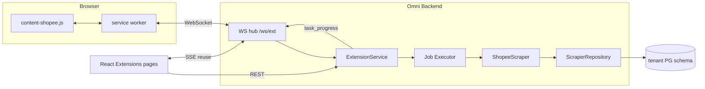
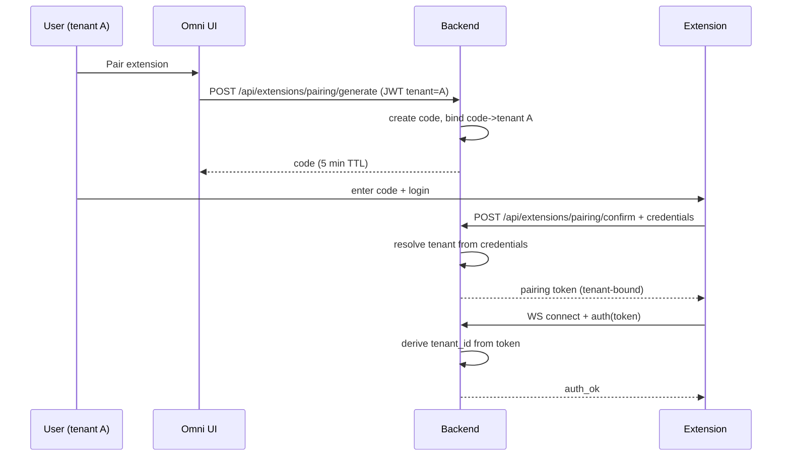
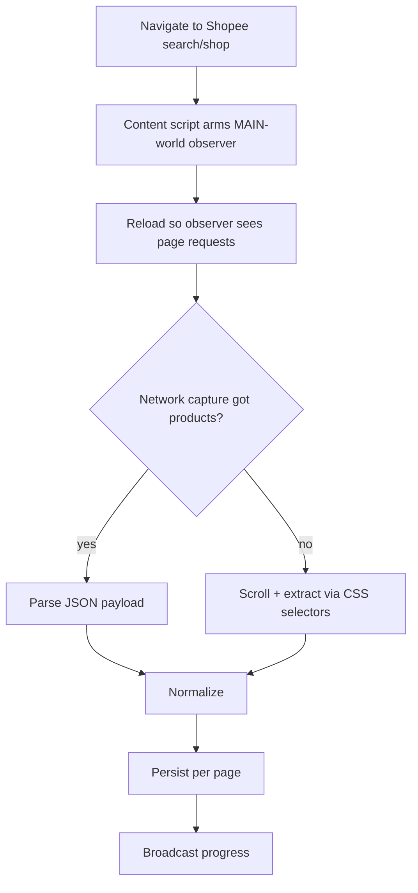

# Extensions Platform + Shopee Scraper — Design

> **Status:** Approved
> **Date:** 2026-09-14
> **Scope:** Phase 1 (extension runtime) + Phase 2 (Shopee scraper)
> **Deferred:** Phase 3 (export), Phase 4 (scheduling) — separate specs

## 1. Problem

Omni is a multi-tenant OMS that integrates with Shopee, Lazada, and TikTok exclusively
through official platform SDKs. There is no browser automation, no scraped-data path, and
no way to collect public marketplace data (competitor pricing, listing quality, keyword
research) that the official APIs do not expose.

AutoFlow (`C:\Users\PC\Documents\Project\extensions`) already solves this: a Chrome MV3
extension driven by a Go WebSocket hub, with a mature Shopee scraper in both Go
(`internal/platforms/shopee/`, ~70 files) and Python/Camoufox. This design ports that
capability into Omni as a first-class feature, adapted to Omni's tenant model and
existing job infrastructure.

## 2. Goals

1. Pair a Chrome extension to an Omni tenant and drive it over WebSocket.
2. Scrape Shopee via three modes: keyword search, shop listing, single product detail.
3. Capture data **network-first with DOM fallback** (hybrid).
4. Persist scraped products per tenant, visible in the Omni UI.

## 3. Non-Goals (this spec)

- Export to CSV/XLSX (Phase 3)
- Scheduled/recurring scrapes (Phase 4)
- Camoufox/Python headless path — extension only for now
- Shop audit / AI scoring / keyword research (AutoFlow features; separate future work)
- Lazada/TikTok scraping

## 4. Verified Existing Infrastructure

Confirmed by code inspection. These are reused, not rebuilt.

| Concern | Existing asset | Location |
|---|---|---|
| Tenant identity | `tenant_id` is a **JWT claim** | `backend/internal/utils/jwt.go:36-41` |
| Auth context | sets `userID`, `tenant_id`, `role` | `backend/internal/middleware/auth.go:72-76` |
| Tenant enforcement | rejects empty with 401; developer `x-tenant-id` override | `backend/internal/middleware/tenant.go:29-94` |
| Tenant list | `system.tenants` where `is_active` | `backend/internal/services/tenant_service.go:37-71` |
| Schema naming | `tenant_{tenantID}` | `backend/internal/config/database.go:151` |
| Job queue | `models.Job` + statuses + `JobHistory` | `backend/internal/models/job.go:19-66` |
| Job executor | 5s poll, `ClaimNextJob`, timeout, history | `backend/internal/services/jobs/executor.go` |
| Route pattern | `RegisterX(router, handler)` + Auth + Tenant | `backend/internal/routes/wholesale_routes.go:6-16` |
| Migration | add model to `requiredModels`/`optionalModels` | `backend/internal/config/migration.go:84-192` |
| Frontend routing | lazy `React.lazy` + `<Route>` in `App.tsx` | `frontend/src/App.tsx:31-62,166` |
| API client | typed snake_case modules on `apiClient` | `frontend/src/api/audit.ts` |
| Query hooks | TanStack Query w/ `refetchInterval` | `frontend/src/hooks/useScriptMonitor.ts:26-31` |
| Handler tests | testify + httptest + stub tenant middleware | `backend/internal/handlers/wholesale_test.go:20-57` |

**Not present (must be built):** any WebSocket server/client. `gobwas/ws` appears in
`go.mod` only as an *indirect* dependency and cannot be imported until promoted to direct.

**Correction to an earlier assumption:** Omni does have a task runner — a DB-backed
`jobs` table with a polling executor. Scrape jobs reuse it rather than inventing a
parallel task concept.

**Source material to port:** `extensions/internal/hub/` (event-loop hub, in-flight limits,
result-channel correlation, pairing, capabilities), `extensions/extension/` (MV3 worker,
command dispatch), `extensions/internal/platforms/shopee/` (scraper, selectors, pagination).

## 5. Architecture



### 5.1 Transport: WebSocket upstream, existing SSE downstream

- **Upstream (extension → server):** new WebSocket at `GET /api/extensions/ws`.
- **Downstream (server → UI):** reuse the proven SSE pattern from
  `notification_handler.go:58-111` rather than building a second WS just for the
  browser. Progress events flow over the existing SSE plumbing; no new browser transport.

This deliberately deviates from AutoFlow, which broadcasts to dashboards over the same WS
hub. Omni already has a working, authenticated SSE channel; adding browser-facing WS would
duplicate it for no gain.

### 5.2 Hub design (ported from AutoFlow)

Single-goroutine event loop owning all mutable maps — no mutexes on the hot path. Ported
semantics, trimmed to Omni's needs:

| Concept | Behaviour | Source |
|---|---|---|
| Event loop | one goroutine, select over channels | `hub.go:131-190` |
| In-flight limit | max 10 concurrent commands per extension | `hub.go:19` |
| Result correlation | `msgID → chan WSMessage` registry | `hub_ws.go`/`hub_api.go` |
| Buffer guard | bounded send channel, drop with log | `hub_msg_send.go:33-42` |
| Disconnect handling | mark status, fail in-flight jobs | `hub_helpers.go:120` |
| Pairing | time-limited code, capability negotiation | `sw-pairing.js` |

**Trimmed (YAGNI):** dashboard broadcast, nonce/CSRF relay, Instagram relay, offscreen
document WS surrogate, chunked message assembly. Omni's SW talks to the server directly.

Concurrency: Go's `net/http` handles one goroutine per WS connection, so the hub must be
correct under concurrent `SendToExtension` — the single-loop design guarantees this.

### 5.3 Multi-tenant binding — "install per tenant"

Each tenant pairs its **own** extension install against its **own** tenant-bound token.
The extension never declares its tenant; the server derives it from the JWT.



**Invariants (must hold):**

- The extension sends **no** `tenant_id`. Tenant comes from the token server-side.
- A pairing token grants exactly one tenant. No default, no fallback.
- Pairing codes are single-use with a short TTL, stored server-side and bound to a tenant.
- The WS handshake rejects any token whose tenant is missing/inactive — mirroring
  `middleware/tenant.go`'s 401-on-empty rule.
- Progress and results are written only into the tenant schema derived from the token,
  never from a client-supplied value.

`bertigamart` is a value in `system.tenants`, read at runtime. It is **never** hardcoded.

### 5.4 Data flow: network-first with DOM fallback



The MAIN-world observer follows the **existing, tested** AutoFlow pattern
(`main-network-observer.js`) including its safety contract: read-only — never aborts,
blocks, or rewrites a request; observation failures are swallowed; bounded body (4000
chars) and buffer (20 entries).

Two-phase arming is required and must not be simplified away: the observer registers its
hooks on **new document creation**, so capturing the initial network traffic means arming
first and then reloading. The CDP-equivalent mechanism in AutoFlow is
`Page.addInitScript` (`python/src/fingerprint/injector.py:44`).

DOM extraction is retained as the fallback, ported from
`extensions/internal/platforms/shopee/scraper_extract.go`, including its three fallback
selector sets and the `extractShopeeItemID` link regex (`-i.\d+.(\d+)`).

### 5.5 Why hybrid

The existing AutoFlow scraper is 100% DOM-selector based, which is why it needs three
failure-prone selector sets and a captcha solver. Shopee's own search/product endpoints
return clean structured JSON. Network-first is primary because it is more robust and
cheaper; DOM remains as the fallback because Shopee actively obfuscates and
intermittently changes its internal API surface, and a pure-network design would fail
hard the moment it is blocked.

## 6. Components

### 6.1 Backend (Go)

```
backend/internal/
├── extensions/                    # NEW package
│   ├── hub.go                     # event loop, client registry
│   ├── hub_types.go               # WSMessage, sendCmd, resultReg
│   ├── hub_send.go                # SendToExtension, in-flight limits
│   ├── hub_route.go               # inbound routing, result correlation
│   ├── pairing.go                 # code generation, token mint, tenant binding
│   ├── client.go                  # per-connection read/write pumps
│   └── hub_test.go
├── services/extensions/
│   ├── extension_service.go       # pairing orchestration, connection status
│   ├── scrape_service.go          # job orchestration, page loop, persistence
│   └── scrape_service_test.go
├── services/scraper/shopee/
│   ├── scraper.go                 # search/shop/product entrypoints
│   ├── selectors.go               # DOM fallback selector sets
│   ├── extract.go                 # normalization, item-id, price cleaning
│   ├── network.go                 # parse Shopee JSON payloads
│   └── *_test.go
├── handlers/extensions/
│   ├── extension_handler.go       # list, pairing, delete
│   ├── scrape_handler.go          # start/stop/status
│   └── ws_handler.go              # WS upgrade
├── models/extension.go            # Extension, PairingCode, ScrapedProduct
├── repositories/extension_repo.go
└── routes/extension_routes.go
```

**File-size discipline:** the ~300-line signal applies. `hub.go`, `scrape_service.go`, and
`scraper.go` are the likely offenders; split by responsibility (send / route / lifecycle)
rather than letting them grow.

### 6.2 Data model

New models registered in `MigrateTenantDatabase` (`config/migration.go`):

| Model | Purpose | Migration bucket |
|---|---|---|
| `Extension` | paired installs: id, extension_id, user_id, hostname, versions, capabilities, status, last_seen | optional |
| `PairingCode` | short-TTL single-use codes bound to tenant | optional |
| `ScrapedProduct` | task_id, product_name, price, sold, link, image_url, shopee_item_id, page_number | optional |

Scrape jobs reuse **existing** `models.Job` (`job.go:19-41`) via the existing executor
rather than a parallel task table. Job type constants are added to `models/job_types.go`.

Schema note: these tables live inside `tenant_{id}`; no `tenant_id` column is needed
(schema isolation), matching `models.Job`'s convention.

### 6.3 Chrome MV3 extension

Port of AutoFlow's extension, reduced to Shopee:

```
extension/
├── manifest.json          # MV3; host_permissions scoped to shopee.co.id + Omni origin
├── service-worker.js      # WS connect/auth/reconnect, command dispatch
├── content-shopee.js      # in-page Shopee commands (scroll, extract, paginate)
├── main-network-observer.js  # MAIN-world fetch/XHR observer (read-only)
└── popup.html             # pairing UI
```

Changes from AutoFlow:

- **WS client runs directly in the service worker.** AutoFlow needed an offscreen document
  because a persistent WS is unreliable in MV3 SWs; that surrogate layer is dropped here
  unless empirical testing shows it is required. **This is a known risk — see §9.**
- Commands reduced to the Shopee set: `open_tab`, `close_tab`, `goto`, `reload`, `wait`,
  `smart_scroll`, `extract`, `extract_all`, `observe_network`, `install_observer`.
- Host permissions narrowed from `<all_urls>` to Shopee + the Omni origin.

### 6.4 Frontend

New top-level sidebar item **Extensions** with submenu:

| Route | Page |
|---|---|
| `/extensions` | Installed Extensions — pairing, status, connect/disconnect |
| `/extensions/shopee` | Shopee Scraper — start search/shop/product scrape |
| `/extensions/results` | Results — scraped products, filter by task |

Wired as: lazy import in `App.tsx`, entry in `Sidebar.tsx` (and `MobileNav.tsx`), typed
API module in `frontend/src/api/extensions.ts`, query hooks in `frontend/src/hooks/`.
All API types snake_case.

## 7. API Surface

All under `/api/extensions`, all requiring `middleware.Auth()` + `middleware.Tenant()`
unless noted.

| Method | Path | Purpose |
|---|---|---|
| GET | `/api/extensions` | list paired extensions for tenant |
| POST | `/api/extensions/pairing/generate` | create pairing code |
| POST | `/api/extensions/pairing/confirm` | extension confirms pairing (public) |
| DELETE | `/api/extensions/{id}` | unpair + force-disconnect |
| GET | `/api/extensions/ws` | WebSocket upgrade (token authenticated, public) |
| POST | `/api/extensions/scrape` | enqueue scrape job → 202 with job_id |
| GET | `/api/extensions/scraped-products` | paginated results |

### As-built deviations from the original draft

Two endpoints in the original draft were **not** implemented as separate routes:

- `GET /api/extensions/scrape/{job_id}` and
  `POST /api/extensions/scrape/{job_id}/stop`.

They would have duplicated `GET /api/jobs/:id` and
`POST /api/jobs/cancel/:jobId`, which already exist and operate on the same
`jobs` table. A scrape is queued via the standard job queue, so those generic
endpoints already give status and cancellation for a scrape job. Adding a second
control surface would have meant two places to keep in sync for no added
capability.

The scrape endpoint therefore returns **202 Accepted** with the job id rather
than running inline, and the job id doubles as the results group id — so a caller
goes straight from "queued" to `scraped-products?job_id=...`.

Response envelope follows Omni convention exactly:
`{"success": true, "data": ...}` / `{"success": false, "error": "..."}`.
No `success: true` with an error message.

## 8. Error Handling

| Condition | Behaviour |
|---|---|
| Missing/invalid token on WS | Close handshake, no registration |
| Token tenant inactive | Reject at handshake |
| Extension disconnects mid-scrape | Mark job `failed`, persist partial results, record reason |
| Captcha / block detected | Fail job with explicit reason; no silent empty success |
| Network capture empty | Fall back to DOM; if both empty, fail with reason |
| Zero products on a page | Retry; stop after 3 consecutive empty pages |
| Job exceeds max duration | Cancel context, mark `failed` with timeout message |
| Malformed extension payload | Reject message, log, keep connection alive |

No empty catch blocks. All errors wrapped with context. Failures carry a reason so a
failure is never silent.

## 9. Risks and Open Questions

| # | Risk | Mitigation |
|---|---|---|
| 1 | **MV3 service worker cannot hold a reliable WebSocket.** AutoFlow solved this with an offscreen document; this design initially drops it. | Spike before committing: if the SW WS drops repeatedly, port the offscreen surrogate. Do not treat as settled. |
| 2 | `gobwas/ws` is indirect; promoting it changes `go.mod`. | Either promote explicitly and justify, or add `gorilla/websocket` as the proven AutoFlow choice. Decide in the plan. |
| 3 | Shopee's internal endpoints are undocumented and change without notice. | DOM fallback is mandatory, not optional. Selectors kept in one file for fast repair. |
| 4 | ToS / rate limits on scraping. | Rate-limit per extension, cap concurrent sessions, record throughput. Operator responsibility documented. |
| 5 | Captcha handling is not ported in this phase. | Fail loudly with a distinct reason; captcha solving is a separate spec. |
| 6 | Tenant isolation regression is a data-leak class bug. | Tests must assert a tenant-A token can never read/write tenant-B data. |
| 7 | Scraped data volume per tenant. | Paginate; add retention policy in Phase 3. |

## 10. Testing Strategy

Per Omni rules (`TESTING_RULES.md`, `AGENTS.md`) — TDD, happy path insufficient.

**Backend**

- Hub: concurrent sends, in-flight limit, result correlation, disconnect mid-flight,
  late-result drain without panic. Unit tests with no network.
- Pairing: code TTL, single-use, tenant binding, expired/foreign code rejection.
- **Tenant isolation:** token for tenant A must never reach tenant B's schema. Explicit
  negative test.
- Scraper: network parser against recorded JSON fixtures; DOM extractor against saved HTML;
  item-id and price-cleaning table tests ported from AutoFlow.
- Handlers: testify + httptest + stub tenant middleware (existing pattern); missing-tenant
  → 401.
- Integration: fake extension client over a real WS to a `httptest` server, end-to-end
  command → result.

**Frontend**

- Vitest unit tests for API module and hooks.
- Playwright e2e for pairing flow and results table (existing `frontend/e2e/` pattern).

**Verification gates before completion**

```bash
cd backend && go build ./... && go test ./...
cd frontend && npm run build && npm run lint && npm run test
```

Plus manual dry-run evidence: pair a real extension, run one scrape, confirm rows land in
the correct tenant schema.

## 11. Implementation Order

1. Models + migration + repository (schema first, no behaviour)
2. Hub core + tests (event loop, send, route, result correlation)
3. Pairing + tenant binding + isolation tests
4. WS endpoint + handler wiring + routes
5. Extension skeleton: manifest, WS connect/auth, pairing popup
6. Shopee content script: DOM extraction path (proves end-to-end)
7. Network-first capture via MAIN-world observer, with DOM fallback
8. Scrape service: job orchestration, pagination, resume, persistence
9. Frontend: sidebar, pairing page, scraper page, results page
10. e2e + manual verification against a real Shopee page

Steps 6→7 order is deliberate: get a working end-to-end slice on the simpler path first,
then add the network-first optimization with a proven fallback already in place.

## 12. Deferred to Later Specs

- **Phase 3:** CSV/XLSX export, retention policy, result filtering/aggregation.
- **Phase 4:** scheduled scrapes via existing `AutoFunctionConfig`
  (`models/auto_function.go`), price-alert thresholds.
- Beyond: Camoufox headless fallback, captcha solving, shop audit/AI scoring,
  Lazada/TikTok scrapers.

## 13. Pre-existing Conditions (not introduced here)

Recorded so they are not mistaken for regressions from this feature, and so
anyone picking this up knows the baseline is not green.

| Package | Status | Evidence |
|---|---|---|
| `internal/utils` | `TestIsEncrypted/valid_base64_but_not_fernet` fails | Reproduced in a worktree at baseline commit `28e4e786`, before any extensions work |
| `internal/services` | Multiple failures (migration backfill, bulk ship status validation, booking sync idempotency, order sync staleness) | Same baseline worktree, failing identically |
| `frontend` | `PlatformsTab.test.tsx` — "disables manual token actions..." fails | Reproduced with all extensions work stashed; file unmodified |
| `rules-master/validate_skill_references.py` | Crashes with `KeyError: 'category'` at line 187 | Fails identically with the rule changes reverted |

Also noted: `rules-master/sync_rules.py --check` was failing with
`DRIFT DETECTED` (exit 1) before this session's rule work and passes now.
