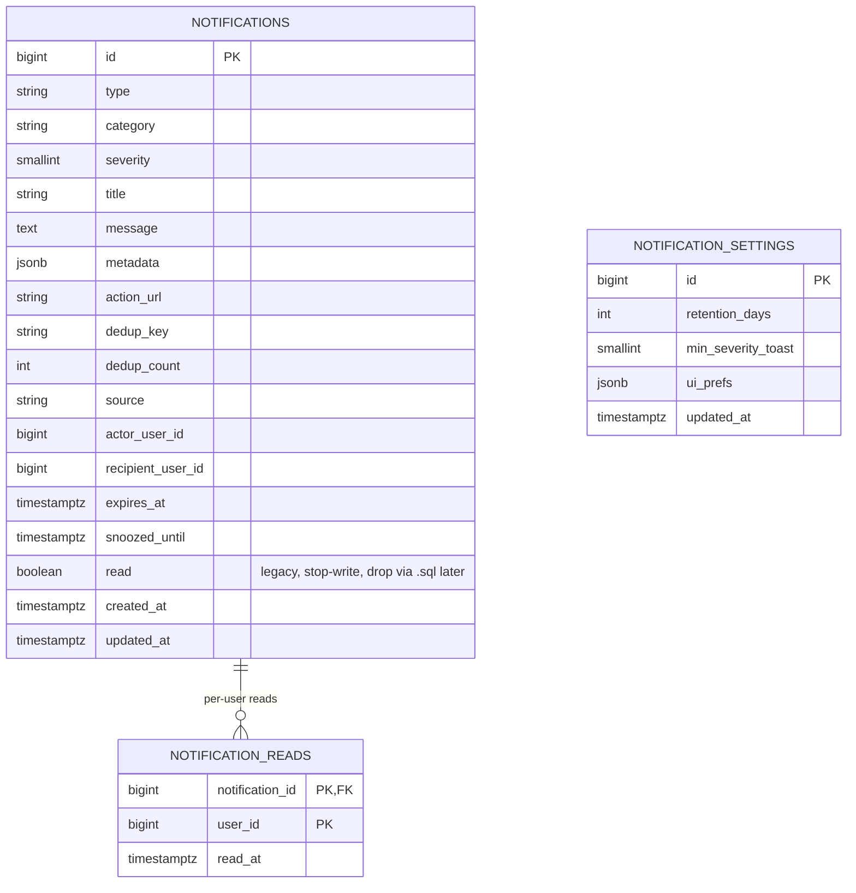
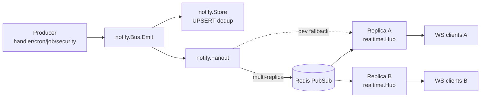
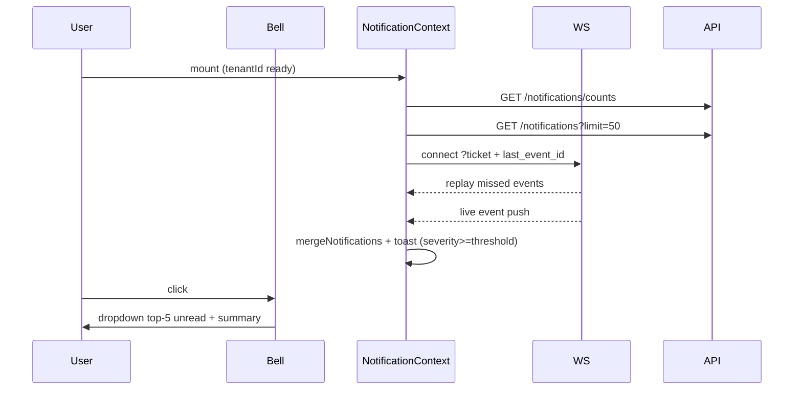
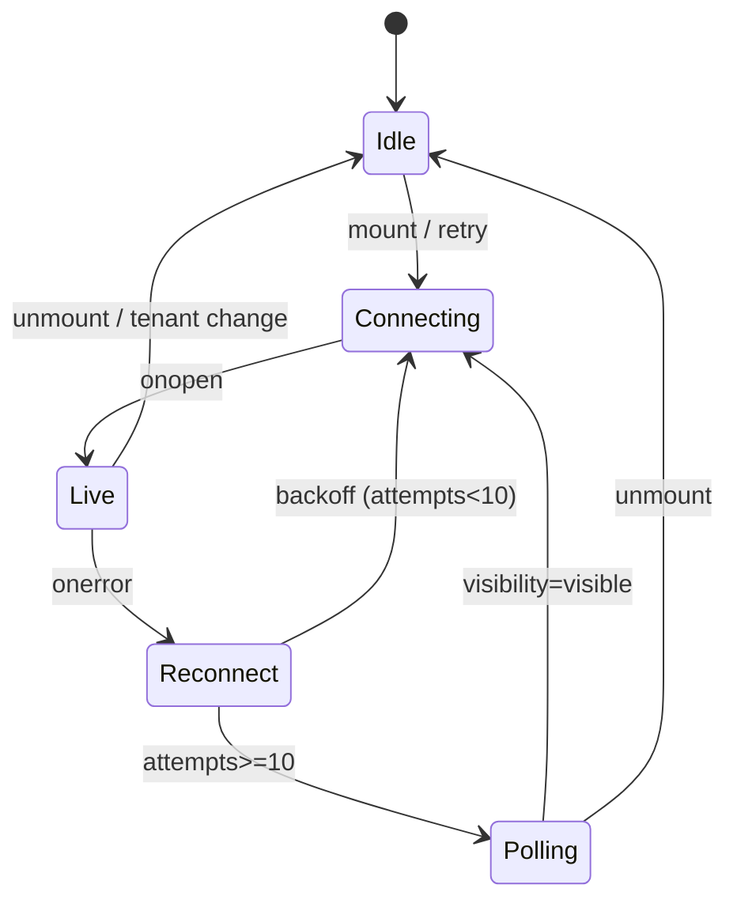

# Notifications V2 — Full Rearchitecture (P0+P1+P2, in-app only)

> Status: **Approved** — 2026-09-16
> Owner: Notification System refactor
> Related: `/notifications` page evaluation (session 2026-09-15)

## Overview

Rearsitek sistem notifikasi in-app secara menyeluruh: keamanan (P0), scaling &
model (P1), dan UX/bulk (P2) dalam satu spec. Channel adapters (email/telegram/
webhook) **out of scope**.

Latar belakang: audit menemukan gaps kritis — read state per-tenant (bug),
`action_url` open-redirect, sanitize tidak dipakai di SSE handler, tidak ada
dedup (storm dari cron), realtime WS dead code path, model terlalu tipis, dan
layout single-column dengan filter tidak lengkap.

## Non-Goals

- Delivery channels di luar in-app (email/telegram/webhook).
- Notifikasi per-role atau ACL kompleks (cukup NULL = tenant-wide, atau
  `recipient_user_id` spesifik).
- i18n konten notifikasi.
- Backend integration test terhadap Redis Pub/Sub end-to-end (di-cover FE E2E).
- Frontend unit test untuk `NotificationContext` (di-cover E2E).

## Design Decisions

| Area | Keputusan | Alasan |
|---|---|---|
| Read state | Per-user via tabel `notification_reads` | Fix bug user A mark-all → user B kehilangan unread |
| Scaling | Redis Pub/Sub + `Last-Event-ID` replay | Tahan multi-replica + restart |
| Transport | WebSocket menggantikan SSE; SSE deprecated 1 release | Backend sudah publish ke `realtime.Hub`; hilangkan dead code |
| Dedup | DB partial unique index + helper `notify.EmitWithKey()` | DB race-safe, helper konsisten cross-producer |
| Channels | In-app only | User memilih baseline saja |
| `action_url` | Path-only, regex `^/[A-Za-z0-9\-_./?=&%#]*$` | Paling ketat, eliminasi open-redirect |
| Legacy `read` | Berhenti tulis dari kode; DROP kolom via file `.sql` manual | Konsisten dengan policy AutoMigrate additive-only |
| Layout | Master-detail 2-column + group-by-hari + severity rail + settings drawer | User memilih full redesign; drilldown di sm/md |
| Bulk features | Mark N read, Delete N, Snooze, Search, Retry retriable | User select-all |

## Migration Strategy (aligned to project's AutoMigrate policy)

Repo pakai **GORM AutoMigrate additive-only** — kolom tidak pernah di-DROP
otomatis. File `.sql` di `backend/migrations/` adalah dokumentasi/safety-net,
dijalankan manual saat perlu.

Karena itu:
- **Kolom baru & tabel baru** → via GORM AutoMigrate (`internal/config/migration.go`).
- **Partial unique index, backfill** → custom SQL block di `MigrateTenantDatabase`
  (pattern sama dengan `idx_platform_links_unique`).
- **DROP `notifications.read`** → file `backend/migrations/notifications_v2_drop_legacy_read.sql`
  yang dijalankan manual ops setelah:
  1. Backfill `notification_reads` sukses.
  2. Deploy sukses (semua read/write via JOIN `notification_reads`, `read` tidak lagi disentuh kode).
  3. Verifikasi 1 minggu tanpa regresi.

## Data Model



## Backend Architecture



Paket baru `backend/internal/notify/`:
- `bus.go` — `Bus.Emit(ctx, Event)`, `Bus.EmitWithKey(ctx, key, Event)`.
- `store.go` — wrap repositories: UPSERT dedup, per-user reads, bulk ops, counts, snooze.
- `fanout.go` — interface `Fanout { Publish(tenantID string, ev Envelope) }`.
- `fanout_redis.go` — implementasi Redis Pub/Sub (channel `omni:notif:{tenantID}`).
- `fanout_inproc.go` — implementasi in-process (dev fallback tanpa Redis).
- `sanitize.go` — port `notificationSecurity.ts` patterns ke Go.
- `safe_url.go` — validasi `action_url` path-only.

Transport WS baru:
- `internal/handlers/notification_ws.go` — upgrade WS, hello dengan `last_event_id`,
  replay dari DB, live loop dari `realtime.Hub` subscription.
- Rename `sse_ticket_handler.go` → `realtime_ticket_handler.go` (shared ticket
  store WS & SSE deprecation window).

Endpoint baru:
- `GET /api/notifications/counts` → `{total, unread, by_severity}`.
- `POST /api/notifications/:id/snooze` body `{until: RFC3339}`.
- `POST /api/notifications/bulk/read` body `{ids: []}`.
- `POST /api/notifications/bulk/delete` body `{ids: []}`.
- `GET /api/notifications?q=&severity=&category=&from=&to=&since_id=&limit=`.
- `GET /api/notifications/ws?ticket=` (WebSocket).

Handler yang di-refactor:
- Mutasi return `{success, data:{affected}}` — fix false-positive.
- `List` LEFT JOIN `notification_reads` (per-user `read` computed).
- `MarkAsRead/MarkAllAsRead` insert ke `notification_reads` alih-alih UPDATE `read`.

## Frontend Architecture



Struktur baru `frontend/src/components/notifications/`:
- `NotificationList.tsx` — list kiri (master), group-by-hari, severity rail, checkbox.
- `NotificationDetailPane.tsx` — detail kanan, sticky action bar.
- `NotificationFilterBar.tsx` — multi-select filter + search.
- `NotificationBulkToolbar.tsx` — sticky bar saat >0 selected.
- `NotificationSettingsDrawer.tsx` — retention_days + min_severity_toast.
- `NotificationSeverityRail.tsx` — garis kiri 3px per severity.

State machine reconnect:



Backoff: `min(5000 * 2^attempts, 60000)` + jitter ±20%.

## Security Controls (P0)

1. `action_url` validation di BE (reject 400) + FE (safe-navigate helper).
2. `sanitizeForUser` port ke Go, dipakai di `Bus.Emit` sebelum insert.
3. FE `NotificationContext` sanitize `title`/`message` sebelum toast.
4. WS/SSE ticket 1x pakai, TTL 60s (existing).
5. Rate-limit `/notifications/ws` connect: 10 per menit per user.

## Test Strategy

**In-scope**:
- BE unit (TDD wajib per AGENTS.md):
  - `notify/store_test.go`: dedup race (100 goroutine same key → 1 row, count=100).
  - `notify/store_test.go`: per-user read (userA mark → userB tetap unread).
  - `notify/safe_url_test.go`: allow `/orders/123`; reject `https://evil`, `//evil`, `javascript:`, `data:`, empty.
  - `notify/sanitize_test.go`: reject stack/SQL/JWT/panic → SAFE_FALLBACK.
  - `repositories/notification_repository_test.go`: bulk ops return N, counts endpoint, snooze filter.
- FE E2E Playwright:
  - Master-detail flow di ≥lg viewport.
  - Bulk mark/delete + unread counter turun.
  - Filter multi-select + search.
  - Snooze menghilangkan dari Unread tab.
  - 2 user context (per-user reads).
  - Drilldown di sm/md viewport dengan back button.
- Migration test:
  - Backfill 5 read + 5 unread → 5 baris di `notification_reads` (user_id=0 sentinel).
  - Idempoten (run 2x tidak duplicate).
  - Dry-run mode return DDL string tanpa apply.

**Explicitly out-of-scope** (trade-off eksplisit):
- BE integration Redis Pub/Sub end-to-end (di-cover FE E2E happy path).
- FE unit `NotificationContext` (di-cover E2E reconnect via CDP offline).

Gate command sebelum commit:
```bash
cd backend && go build ./... && go test ./internal/notify/... ./internal/repositories/... ./internal/handlers/...
cd frontend && pnpm build && pnpm lint && pnpm exec playwright test notifications-v2
```

## Rollout

1. Merge PR + CI hijau.
2. Deploy image baru → GORM AutoMigrate jalan otomatis, tambah kolom & tabel `notification_reads`.
3. Custom SQL block jalan di `MigrateTenantDatabase`: backfill + partial unique index.
4. `python build.py backup` (mandatory schema-change).
5. Verifikasi `/api/notifications/counts` return format baru + WS connect sukses.
6. Setelah 1 minggu stabil: ops manual jalankan `backend/migrations/notifications_v2_drop_legacy_read.sql` untuk DROP kolom `read`.
7. Release berikutnya: hapus endpoint `/notifications/stream` SSE + hapus `SSEManager` block.

Rollback: redeploy image sebelumnya. Kolom & tabel baru bersifat additive dan
tidak mengganggu image lama (yang tetap baca `notifications.read` legacy).
Migration `notification_reads` isi backfill sudah cukup untuk fallback logic.

## Definition of Done

- [ ] `go build ./... && go test ./internal/notify/... ./internal/repositories/... ./internal/handlers/...` hijau.
- [ ] `pnpm build && pnpm lint && pnpm exec playwright test notifications-v2` hijau.
- [ ] `/api/notifications/counts` return format baru.
- [ ] WS `/api/notifications/ws?ticket=X` receive live + replay missed events.
- [ ] SSE endpoint log deprecation warning.
- [ ] `NotificationsPage` master-detail di ≥lg viewport, drilldown di <lg (screenshot di `.sisyphus/evidence/`).
- [ ] User A mark-all-read tidak affect user B.
- [ ] `action_url=https://evil.com` di POST reject 400.
- [ ] Notif dengan "SELECT * FROM ..." di message → toast SAFE_FALLBACK, DB tetap raw.
- [ ] Storm cron 3x → 1 baris dengan `dedup_count=3`.
- [ ] File `backend/migrations/notifications_v2_drop_legacy_read.sql` tersedia (belum dijalankan otomatis).
- [ ] Commit + push per policy.
